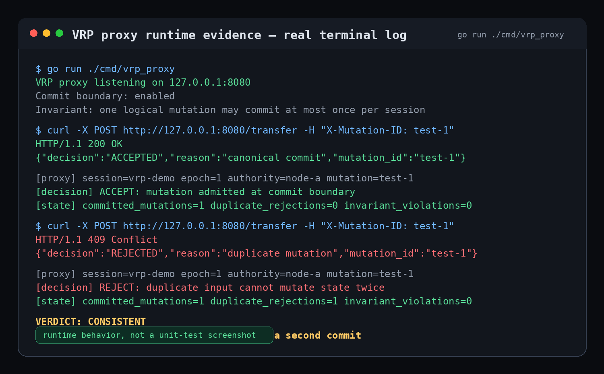

# VRP (Veil Routing Protocol)

VRP is an execution correctness layer for unreliable networks.

It ensures that session identity and state transitions remain correct
even when the network duplicates, drops, reorders, or reroutes packets.

This repository defines the canonical specification of VRP.

---

## Try it now

go run ./cmd/vrp_proxy

curl -X POST http://127.0.0.1:8080/transfer -H "X-Mutation-ID: test-1"
curl -X POST http://127.0.0.1:8080/transfer -H "X-Mutation-ID: test-1"

→ first request accepted  
→ second request rejected  

---

## Runtime evidence

This is not a unit test.

The proxy enforces correctness at the commit boundary:



---

## Runtime evidence

This screenshot is illustrative.

You can reproduce the same behavior locally:

```bash
go run ./cmd/vrp_proxy

curl -X POST http://127.0.0.1:8080/transfer -H "X-Mutation-ID: test-1"
curl -X POST http://127.0.0.1:8080/transfer -H "X-Mutation-ID: test-1"

Expected result:
first request → accepted
second request → rejected

---

## Core Thesis

Transport is not the source of truth.

Correctness must be enforced at the commit boundary.

---

## What VRP Does

VRP answers one question:

is this mutation allowed to change state?

It guarantees:

- one logical mutation → at most one commit  
- duplicate inputs → rejected  
- stale authority → rejected  
- stale epoch → rejected  
- different delivery order → same result  
- independent nodes → same decision  

---

## Try VRP (Start Here)

You can test VRP in minutes.

docs/TRY_VRP.md  
docs/VRP_10_MIN_INTEGRATION.md  
docs/VRP_API.md  

Minimal integration:

decision = vrp.Accept(input)

if decision == ACCEPTED:
    apply_state_change()
else:
    reject

---

## Core Properties

- Session identity does not depend on transport  
- Transport failure does not imply session reset  
- Duplicate inputs must not produce duplicate state transitions  
- Correctness is enforced at the commit layer  
- Replay is not treated as recovery  
- Authority is epoch-bound  
- Epochs are monotonic  
- Convergence must be deterministic  

---

## What This Repository Contains

This is not a production implementation.

This is the canonical specification defining:

- Commit contract  
- Authority resolution rules  
- Epoch semantics  
- Packet binding model  
- Replay semantics  
- Network disorder behavior  
- Multi-node convergence behavior  
- System invariants  

---

## Specification Documents

- docs/VRP_CANONICAL_MODEL.md  
- docs/VRP_COMMIT_CONTRACT.md  
- docs/VRP_AUTHORITY_AND_EPOCHS.md  
- docs/VRP_PACKET_BINDING.md  
- docs/VRP_REPLAY_SEMANTICS.md  
- docs/VRP_INVARIANTS.md  
- docs/VRP_NETWORK_CHAOS_CONTRACT.md  
- docs/VRP_AUTHORITY_RACE_CONTRACT.md  
- docs/VRP_CONVERGENCE_CONTRACT.md  
- docs/VRP_SECURITY_BOUNDARY.md  
- docs/VRP_GLOSSARY.md  

---

## Executable Demos

These demos are not simulations.

They are minimal executable proofs of the specification.

---

### 1. Commit Contract

go run ./cmd/private_canonical_contract_demo

---

### 2. Network Chaos

go run ./cmd/private_network_chaos_contract_demo

---

### 3. Authority Race

go run ./cmd/private_authority_race_demo

---

### 4. Multi-Node Convergence

go run ./cmd/private_multi_node_convergence_demo

---

### 5. Disorder + Multi-Node Convergence

go run ./cmd/private_disorder_multi_node_convergence_demo

---

### 6. Real-World Mutation Boundary

go run ./cmd/private_real_world_demo

---

## Verified Behavior (Tests)

The following invariants are validated via automated tests:

Run:

go test ./...

---

### Concurrency (Commit Boundary)

1000 parallel attempts against the same mutation:

→ exactly 1 ACCEPTED  
→ all others REJECTED_DUPLICATE  

---

### Disorder Convergence

Same logical mutations delivered in different order:

→ identical final committed state  

---

### Authority Race

Competing authorities:

→ exactly one canonical winner  
→ deterministic under reorder  

---

### Canonical Result on Retry

Lost ACCEPTED response:

→ retry returns canonical result  
→ state does not mutate twice  

---

### Network Disorder (Drop / Duplicate / Reorder)

Unreliable delivery conditions:

→ duplicate packets do not cause double execution  
→ dropped packets do not produce inconsistent state  
→ reordered inputs converge to the same result  

---

### Durability Across Restart

Process restart scenario:

→ committed mutations persist across restart  
→ retry after restart returns canonical result  
→ state does not mutate twice  

---

### Multi-Node Determinism

Independent runtimes processing same mutations:

→ identical decision sequence  
→ no divergence between nodes

---

## How to Run

git clone https://github.com/Endless33/vrp-canonical-spec  
cd vrp-canonical-spec  
go run ./cmd/private_canonical_contract_demo  

---

## Key Statement

Correctness is not assumed from the network.

Correctness is enforced during execution.

---

## Status

Canonical specification in progress.

---

## Author

Vitalijus Riabovas  
VRP / Jumping VPN

---

## Intellectual Origin

VRP (Veil Routing Protocol) is an original protocol concept and architecture
developed by Vitalijus Riabovas.

This repository defines its canonical specification, invariants,
and executable behavioral model.

The protocol design, execution semantics, and commit-boundary model
represent independent research and development.

If you build upon or reference this work,
proper attribution is expected.